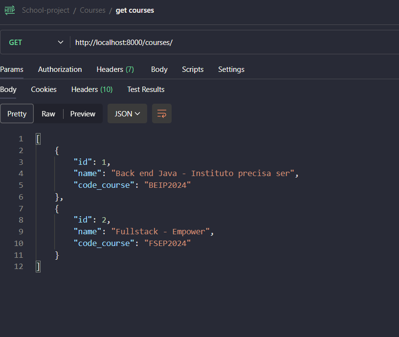
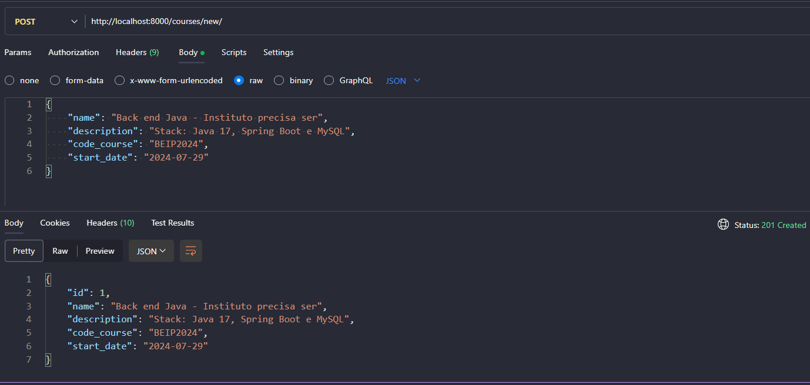
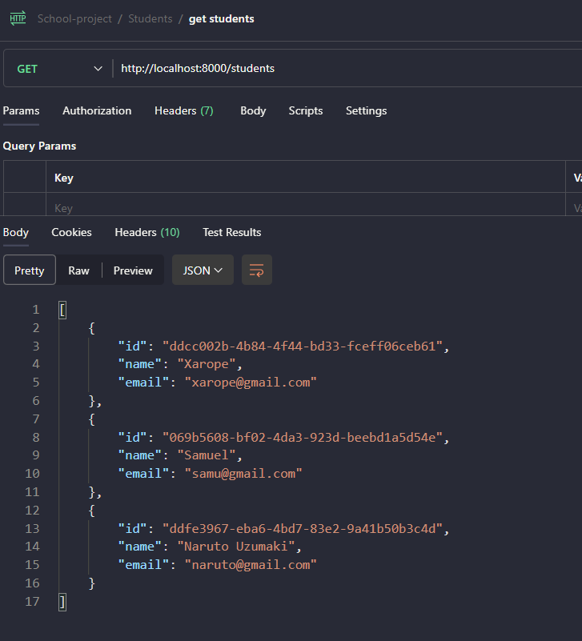
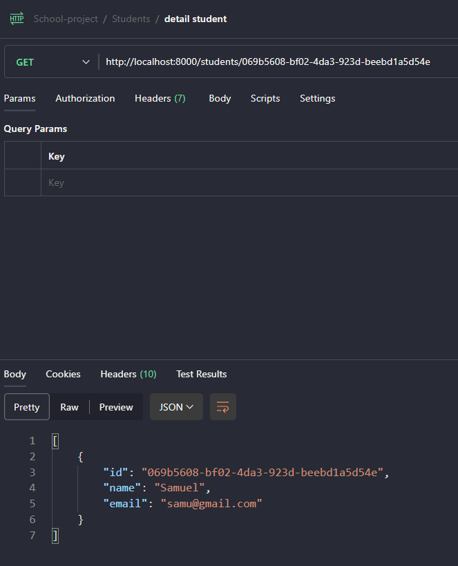
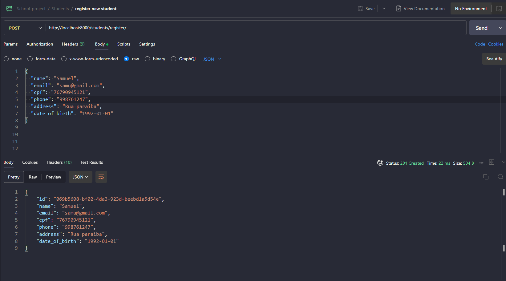
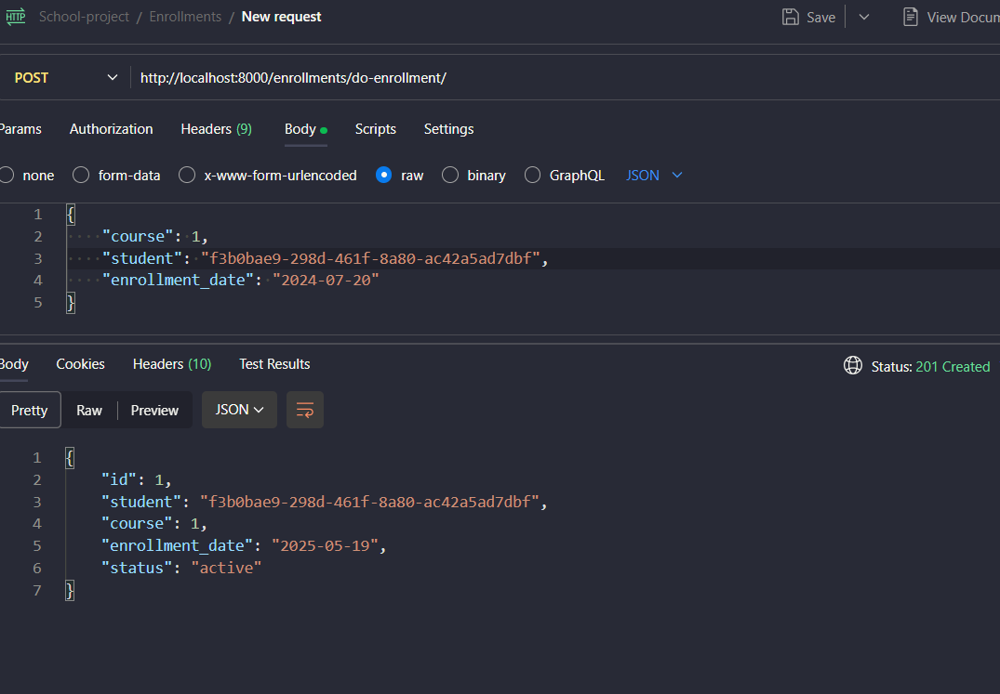
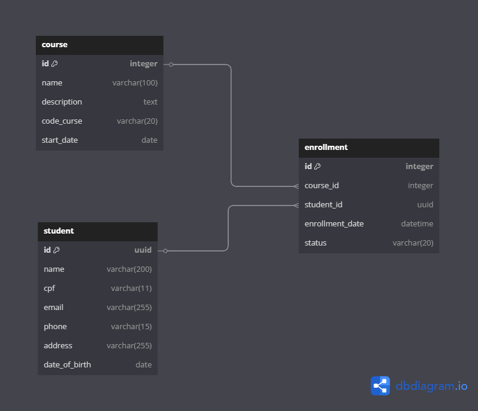

<h1 style='text-align:center'>Projeto Escola</h1>


## Sobre o projeto
Este repositório contém o código-fonte para um **Sistema de Matrículas para Cursos.**

## Endpoints criados

### Courses
- **/courses/:** Retorna todos os cursos


- **/courses/new:** Adiciona mais um curso ao banco de dados


- **/courses/int:course_id/students/:** Retorna os dados dos estudantes matriculados em um curso

### Students
- **/students/:** Retorna os dados dos alunos

- **/students/uuid:student_id/:** Retorna os dados de um usuário especifíco 

- **/students/register:** Registro um novo estudante


### Enrollments
- **/enrollments/**: Retorna todas as matriculas
- **/enrollments/do-enrollment:** Realiza a matricula de um aluno em um curso


### Documentação
- **/swagger:** Gera a interface da documentação do Swagger
- **/redoc:** Gera a documentação mais leve

## Generics
Apesar das rotas estarem definidas, há a possibilidade de testes diretos com o Generics através dos endpoints:

- **/courses/test_generics/:** GET e POST para adicionar um novo curso
- **/students/test_generics/:** GET e POST para adicionar um novo estudante
- **/enrollments/test_generics:** GET e POST para fazer uma matricula


## Banco de dados
O banco de dados utilizado é o PostgreSQL. Iniciado com um imagem docker e suas configurações HardCoded. (Redução de complexidade), portanto, para ter acesso ao banco de dados com algum editor, utilize as credenciais inicializadas no docker-compose.

### Diagrama



## Como rodar
Vamos rodar a aplicação a partir do Docker-compose, portanto, certifique-se de o ter instalado.

As demais configurações como Variáveis para conexão do banco de dados e Variaveis para execução de imagens estão como hardcoded (Definidas no docker-compose) excluindo a necessidade de criar um arquivo .env e configurá-lo.

Faça um clone desse repositório através do comando:

```bash
git clone [URL_REPO]
```

E execute o comando:

```bash
docker-compose up -d
```

No navegador ou postman, faça requisições para o dominio:
```
http://localhost:8000/[URLS DEFINIDAS]
```